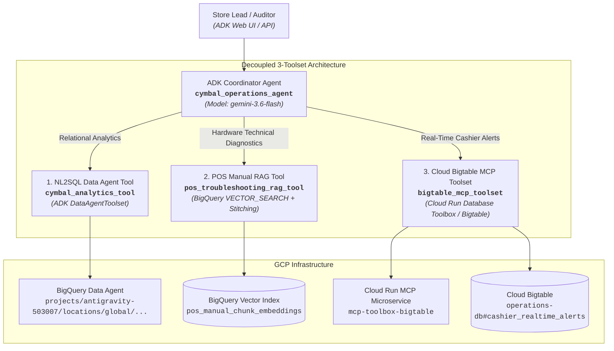

# Cymbal Operations Coordinator Agent (ADK Multi-Tool Architecture)

A multi-tool, decoupled operational coordinator agent built with Google's **Agent Development Kit (ADK)** and powered by **Gemini 3.6 Flash** (`gemini-3.6-flash`). The coordinator orchestrates natural language to SQL analytics across BigQuery and federated AWS S3 tables, semantic RAG hardware troubleshooting with sliding window embeddings, and real-time cashier risk audit metrics from Cloud Bigtable.

---

## 🏛️ Architecture Overview



---

## 🚀 Quick Start & Installation

### Prerequisites
- Python 3.11+
- Google Cloud SDK (`gcloud`) authenticated with Project `antigravity-503007`
- `uv` (recommended) or standard `pip` / `venv`

### Local Environment Setup
```bash
# Clone the repository
git clone https://github.com/Alphnose/daagent.git
cd daagent

# Create virtual environment and install dependencies using Makefile
make setup
make install
```

### Environment Configuration (`.env`)
Create a `.env` file from the provided `.env.example`:
```ini
PROJECT_ID=antigravity-503007
REGION=us-central1
DATA_AGENT_NAME=projects/antigravity-503007/locations/global/dataAgents/cymbal-retail-analytics-data-agent
BIGTABLE_INSTANCE_ID=operations-db
BIGTABLE_TABLE_ID=cashier_realtime_alerts
BIGTABLE_MCP_URL=https://mcp-toolbox-bigtable-z3dyhmkzwa-uc.a.run.app
GOOGLE_GENAI_USE_VERTEXAI=True
GOOGLE_CLOUD_PROJECT=antigravity-503007
GOOGLE_CLOUD_LOCATION=global
GEMINI_MODEL=gemini-3.6-flash
```

---

## 🛠️ Toolsets & Operational Capabilities

| Toolset / Tool | Technology / Engine | Purpose & Behavioral Guarantees |
| :--- | :--- | :--- |
| **`cymbal_analytics_tool`** | Published BQ Conversational Data Agent (`global`) | NL2SQL over retail sales, inventory reconciliation, customer transactions, and cross-cloud AWS S3 checkout logs. Passes glossary terms verbatim with 3x exponential backoff and error masking. |
| **`pos_troubleshooting_rag_tool`** | BigQuery `VECTOR_SEARCH` + `AI.EMBED` | 500-char sliding window chunk embeddings (`text-embedding-005`) with $N-1 \sim N+1$ context window stitching. Similarity threshold $\ge 0.70$ with full-text `SEARCH` fallback and certified decline warnings. |
| **`bigtable_mcp_toolset`** | Database Toolbox MCP (`us-central1`) + ADK `BaseToolset` | Declarative `tools.yaml` integration pointing to Cloud Bigtable `operations-db`. Queries live 1-hour cashier rolling metrics, anomaly scores, and audit flags. |

---

## 🛡️ Guardrails & Safety Mechanisms

1. **Partition Date Clarification Guardrail**: Enforced in `app/prompts.py`. The agent must prompt for a date range or default to a rolling partition window (e.g. last 7 days) before submitting queries to large transactional tables (`pos_transactions_gold`, `historical_transactional_data`). Full-table scans are strictly forbidden.
2. **Certified RAG Decline Warning**: When hardware troubleshooting vector queries fall below cosine similarity 0.70 and full-text fallback finds no matches, the agent outputs the mandatory certified decline warning to prevent hallucinations.
3. **Infrastructure & Stack Trace Exception Masking**: All tool implementations catch runtime exceptions, log full diagnostic traces internally using Python's standard `logging` framework, and return sanitized, user-friendly failure messages to prevent cloud environment leakage.

---

## 🧪 Testing & Verification

Run the comprehensive test suite with strict assertions:

```bash
# Run pytest test suite
make test

# Or run full 7 operational use cases end-to-end
make test-e2e
```

### Verified Operational Use Cases
- **UC 1.1a**: Hardware Error (ERR-PAY-4001 EMV Freeze) -> Toshiba TCx 810 Runbook with HTTPS link.
- **UC 1.1c**: Out-of-Scope Hardware (Ford F-150 Oil) -> Certified decline warning string.
- **UC 1.2a**: Stockout Risk (<20h) -> BigQuery inventory reconciliation query.
- **UC 1.3**: Real-Time Cashier Metrics -> Bigtable row key inspection for `STORE_048#CASH_1190`.
- **UC 2.1a**: Past Warranty Lookup -> Array unnesting and warranty clause relational join.
- **UC 2.2**: Dual Cashier Baseline -> Parallel dispatch (Bigtable live + BigQuery historical).
- **UC 2.3**: Cross-Cloud Offender Audit -> Sequential dispatch (GCP anomaly ranking -> AWS S3 checkout logs).

---

## 🐳 Container Deployment

Build and run using Docker:

```bash
# Build container image
docker build -t cymbal-operations-agent:latest .

# Run container locally
docker run -p 8080:8080 --env-file .env cymbal-operations-agent:latest
```

---

## 📄 License & Attribution
Developed for Google Cloud Elevate Data & AI Advanced Operations Track.
