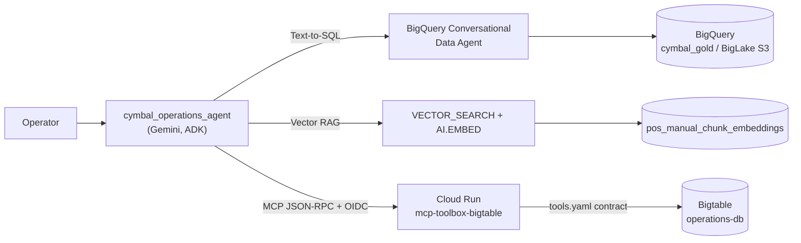

# Cymbal Superstore — Operations Coordinator Agent (ADK)

A production-hardened Google ADK multi-tool coordinator agent for Cymbal Superstore
retail operations. It orchestrates **Text-to-SQL analytics**, **vector RAG over POS
runbooks**, and **real-time Bigtable cashier telemetry** served through a
**declarative MCP (Model Context Protocol) microservice**.

> [!IMPORTANT]
> **Nothing in this repository hardcodes a GCP project, dataset or endpoint.** Every
> environment-specific value is resolved at runtime by [`app/config.py`](app/config.py)
> from environment variables or Application Default Credentials, and the test suite
> statically enforces this (`tests/test_configuration.py`).

---

## 1. Architecture



| Layer | Component | Notes |
| :--- | :--- | :--- |
| Coordinator | [`app/agent.py`](app/agent.py) | Binds 3 toolsets, routes intents, enforces guardrails |
| Prompting | [`app/prompts.py`](app/prompts.py) | Dispatch protocols + partition/out-of-scope guardrails |
| Config | [`app/config.py`](app/config.py) | Lazy, cached resolution of every env-specific value |
| Analytics | [`app/tools/analytics_tool.py`](app/tools/analytics_tool.py) | BigQuery Data Agent, 3 retries with backoff |
| RAG | [`app/tools/rag_tool.py`](app/tools/rag_tool.py) | Chunk embeddings, N-1..N+1 stitching, 0.70 threshold |
| MCP toolset | [`app/tools/bigtable_mcp_tool.py`](app/tools/bigtable_mcp_tool.py) | `McpToolset` over `/mcp` with per-request OIDC |
| MCP contract | [`tools.yaml`](tools.yaml) | Declarative `bigtable-sql` tool + toolset (templated) |
| Fallback | [`app/tools/bigtable_tool.py`](app/tools/bigtable_tool.py) | Native client, used only if MCP is unreachable |

---

## 2. Quickstart

```bash
# 1. Configure your environment
cp .env.example .env && ${EDITOR:-vi} .env      # set PROJECT_ID at minimum
gcloud auth application-default login --project "<PROJECT_ID>"

# 2. Install
make setup && make install

# 3. Deploy the declarative MCP microservice and capture its URL
make mcp-deploy                                  # prints BIGTABLE_MCP_URL
make mcp-verify                                  # asserts the tool contract is live

# 4. Validate
make test-unit          # offline, no GCP calls
make test               # full suite incl. live contract tests
make test-e2e           # 7 operational use cases against the live agent

# 5. Run
make run-web            # ADK Web UI on :8080
```

### Configuration reference

All variables are documented in [`.env.example`](.env.example). Resolution order for
the project id: `PROJECT_ID` → `GOOGLE_CLOUD_PROJECT` → `GCLOUD_PROJECT`/`GCP_PROJECT`
→ the project bound to ADC. If none resolve, a `ConfigurationError` explains exactly
what to set — the agent never silently targets a foreign project.

---

## 3. The MCP microservice (not a bypassed contract)

`tools.yaml` is the **single source of truth** for the Bigtable tool. It is
environment-parameterized and rendered at deploy time:

```
tools.yaml  --envsubst-->  build/tools.rendered.yaml
            --gcloud secrets versions add-->  bigtable-mcp-tools-secret
            --gcloud run deploy-->  mcp-toolbox-bigtable (Cloud Run, private)
```

[`scripts/deploy_mcp.sh`](scripts/deploy_mcp.sh) performs all three steps and then
verifies the served contract with a live `tools/list` JSON-RPC call.

**Routing.** The Database Toolbox exposes MCP at `/mcp` (Streamable HTTP) and
`/mcp/sse` (legacy SSE). A bare `/sse` returns HTTP 404 — targeting it is the classic
cause of a silent fallback to a local database client.

**Authorization.** The Cloud Run service is deployed `--no-allow-unauthenticated`.
The toolset mints an OIDC ID token **per MCP request** through ADK's `header_provider`
hook, trying, in order:

1. `google.oauth2.id_token.fetch_id_token(audience)` — service accounts, GCE/GKE/Cloud Run metadata server
2. `gcloud auth print-identity-token` — local developer workstations

**Fail-fast switch.** Set `BIGTABLE_MCP_REQUIRED=true` to raise instead of degrading
to the direct Bigtable client — recommended for production deployments.

Verify the live contract manually:

```bash
TOKEN=$(gcloud auth print-identity-token)
curl -s -X POST "$BIGTABLE_MCP_URL/mcp" \
  -H "Authorization: Bearer $TOKEN" \
  -H "Content-Type: application/json" \
  -H "Accept: application/json, text/event-stream" \
  -d '{"jsonrpc":"2.0","id":1,"method":"tools/list","params":{}}'
```

---

## 4. Guardrails

1. **Partition Date Clarification Guardrail** — before any BigQuery transactional
   dispatch the agent requires an explicit date, range, rolling interval or bounding
   identifier. Bounds are always expressed dynamically (`CURRENT_DATE()`,
   `DATE_SUB(CURRENT_DATE(), INTERVAL 7 DAY)`), never as a frozen literal date, and the
   applied window is disclosed in the answer.
2. **Certified RAG decline (0.70 threshold)** — when vector search and the full-text
   `SEARCH()` fallback both fail to clear cosine similarity 0.70, the tool returns the
   exact contract string and the coordinator relays it verbatim:

   > WARNING: UNCERTIFIED RESULT - No certified POS troubleshooting documentation matched
   > this query above the 0.70 similarity threshold. This request appears to be out of
   > scope for Cymbal Superstore POS operations. No troubleshooting guidance can be provided.

3. **Infrastructure error masking** — every tool logs exceptions through the `logging`
   package and returns a neutral message. Project paths, datasets, service accounts and
   stack traces never reach the user; `tests/test_operational_use_cases.py` asserts this.
4. **Domain boundaries** — non-retail inquiries are declined rather than answered from
   model knowledge.

---

## 5. Testing

| Command | Scope |
| :--- | :--- |
| `make test-unit` | Offline: config portability, hardcoded-id scan, MCP routing/auth wiring, `tools.yaml` contract, prompt guardrails, agent binding |
| `make test-integration` | Live: OIDC minting, MCP `tools/list` + `tools/call`, RAG retrieval & decline, Data Agent, Bigtable, coordinator dispatch |
| `make test` | Both |
| `make test-e2e` | The 7 documented operational use cases end-to-end |

Integration tests skip (never fail) when credentials or `BIGTABLE_MCP_URL` are absent,
so `make test` is safe to run on a laptop or in a sandboxed CI runner.

**Operational use cases covered**

- UC 1.1a Hardware error (`ERR-PAY-4001`) → certified runbook + GCS link
- UC 1.1c Out-of-scope hardware (Ford F-150) → exact decline warning
- UC 1.2a Stockout risk (<20h cover hours)
- UC 1.3 Real-time cashier metrics via MCP (`STORE_048#CASH_1190`)
- UC 2.1a Warranty transaction lookup
- UC 2.2 Parallel dispatch (live vs 7-day baseline)
- UC 2.3 Sequential cross-cloud offender audit

---

## 6. Container & deployment

```bash
make docker-build       # image carries no project-specific configuration
make docker-run         # local run with your ADC mounted read-only
make deploy-agent       # push + deploy to Cloud Run
```

The image runs as a non-root user, honors Cloud Run's `$PORT`, and receives all
configuration through environment variables at run time.

---

## 7. Repository layout

```
app/
  agent.py               # Coordinator agent (root_agent)
  config.py              # Environment resolution (no hardcoded ids)
  prompts.py             # Dispatch protocols + guardrails
  tools/
    analytics_tool.py    # BigQuery Conversational Data Agent
    rag_tool.py          # Vector RAG + certified decline contract
    bigtable_mcp_tool.py # McpToolset (primary Bigtable path)
    bigtable_tool.py     # Native client fallback
scripts/deploy_mcp.sh    # Render -> Secret Manager -> Cloud Run -> verify
tests/                   # conftest + configuration / MCP / use-case suites
tools.yaml               # Declarative MCP tool contract (templated)
Dockerfile  Makefile  pytest.ini  .env.example
```
